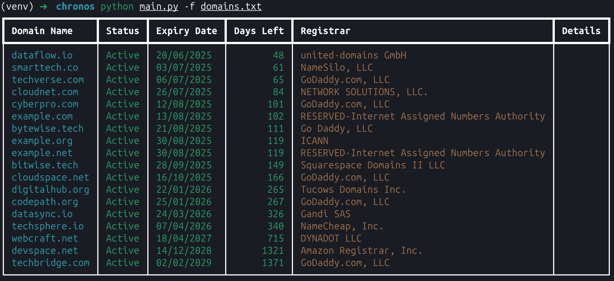

# Chronos

Like Chronos who watched over time itself, this Python script will monitor your chosen domains' expiration dates.


## Table of Contents
- [Features](#features)
- [Quick Example](#quick-example)
- [Quick Start](#quick-start)
- [Installation](#installation)
  - [1. Quick Install (Recommended)](#1-quick-install-recommended)
  - [2. Install with pip](#2-install-with-pip)
  - [3. Manual Installation](#3-manual-installation)
    - [Linux/MacOS Installation](#linuxmacos)
    - [Windows Installation](#windows)
- [Usage](#usage)
  - [Check a Single Domain](#check-a-single-domain)
  - [Check Multiple Domains](#check-multiple-domains)
- [Advanced Options](#advanced-options)
- [Contributing](#contributing)
- [License](#license)

## Features

- Check expiration dates for single or multiple domains (supporting .COM, .NET, .EDU TLDs)
- Beautiful console output with color-coded warnings
- Support for batch processing via domain list files
- Parallel processing for faster bulk checks
- Detailed error reporting and debugging options
- CSV export capability

## Quick Example

Check multiple domains with a beautiful table output:

```bash
python main.py -f domains.txt
```



## Quick Start

1. Clone repo, enter directory, give permissions to bash script to run, run bash script

```bash
git clone https://github.com/a-curious-coder/chronos.git
cd chronos
chmod +x ./install.sh
./install.sh
```

## Installation

Choose one of these simple installation methods:

### 1. Quick Install (Recommended)

```bash
./install.sh
```

This will automatically:
- Check for Python 3.12+
- Create a virtual environment
- Install all dependencies

### 2. Install with pip

```bash
pip install .
```

### 3. Manual Installation

If you prefer to set things up manually:

1. Ensure you have Python 3.12+ and pip installed
2. Create and activate a virtual environment (optional but recommended):

#### Linux/MacOS
```bash
python -m venv venv
source venv/bin/activate
```

#### Windows
```powershell
python -m venv venv
.\venv\Scripts\activate
```

3. Install dependencies:
```bash
pip install -r requirements.txt
```

## Usage

### Check a Single Domain

```bash
python main.py -d example.com
```

### Check Multiple Domains

Create a file with your domains (one per line):

```bash
# domains.txt
example.com
github.com
google.com
```

Then run:

```bash
python main.py -f domains.txt
```

## Advanced Options

- `--parallel`: Enable parallel processing for faster bulk checks 
- `--csv output.csv`: Save results to a CSV file
- `--debug`: Enable detailed debug output

## License

This project is licensed under the GNU General Public License v2 - see the [LICENSE](LICENSE) file for details.

---

Created by [a-curious-coder](https://github.com/a-curious-coder)


